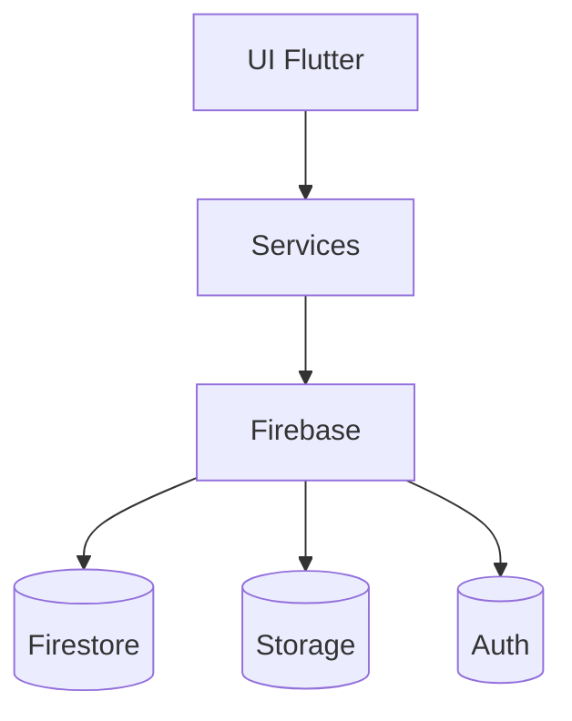

# BeeApp - Modèles Système

## Architecture Globale


## Design Patterns
1. **Provider** : Gestion d'état
2. **Repository** : Abstraction des données
3. **Singleton** : Services Firebase
4. **Observer** : Écoute des changements

## Composants Clés
- **AuthService** : Gestion authentification
- **DatabaseService** : Accès Firestore
- **StorageService** : Téléchargements fichiers
- **RouterService** : Navigation (GoRouter)

## Flux de Données
1. Utilisateur déclenche action
2. Service traite la requête
3. Firebase met à jour les données
4. Provider notifie les écrans
5. UI se met à jour

## Relations Entre Composants
```mermaid
classDiagram
    class UI {
        +build()
        +handleUserInput()
    }
    class Services {
        +AuthService
        +DatabaseService
    }
    class Firebase {
        +Firestore
        +Storage
    }
    UI --> Services
    Services --> Firebase
